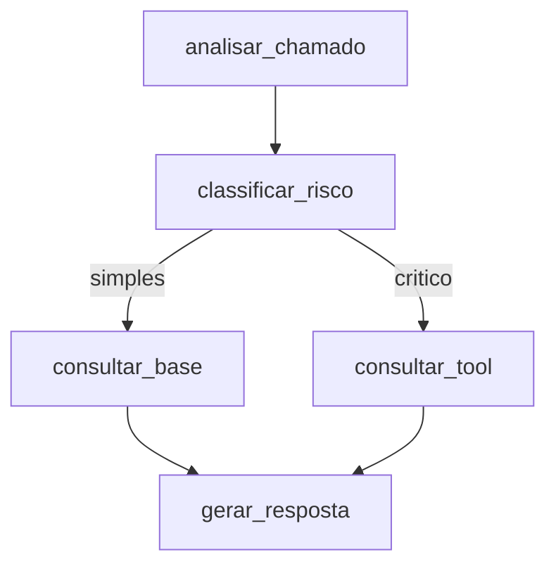

# Agente Inteligente de Triagem de Chamados Técnicos

## 1. Descrição da Solução e Objetivo
Este projeto consiste em um Agente Inteligente para Triagem de Chamados Técnicos. O objetivo é receber um chamado (com título e descrição), analisá-lo e classificar seu risco. Dependendo da severidade, o agente aciona uma base de conhecimento para problemas simples ou uma ferramenta operacional crítica para chamados severos (exigindo aprovação humana). O resultado final é uma resposta estruturada que facilita o encaminhamento.

## 2. Arquitetura e Fluxo LangGraph
A arquitetura foi implementada utilizando **LangGraph** explícito, sem depender de agentes genéricos (como o `create_agent` legado).



## 3. Descrição do State, Nodes e Decisão Condicional
- **State**: Um `TypedDict` chamado `GraphState` armazena `ticket_title`, `ticket_description`, `risk_level`, `context`, `tool_output`, `structured_response` e `error`.
- **Nodes**:
  - `analisar_chamado`: Ponto de entrada.
  - `classificar_risco`: Chama o LLM para definir a severidade ("simples" ou "critico").
  - `consultar_base` / `consultar_tool`: Nós operacionais.
  - `gerar_resposta`: Gera o output estruturado final em formato JSON/Pydantic.
- **Decisão Condicional (`route_ticket`)**: Se `risk_level` for "critico", roteia para `consultar_tool`. Se for "simples", roteia para `consultar_base`.

## 4. Descrição da Tool
A aplicação utiliza duas tools principais:
- **`consultar_base`**: Uma tool de contexto que busca soluções documentadas (simula um RAG interno).
- **`consultar_tool`**: Uma ferramenta sensível que altera estado (ex: invalida cache). Ela possui **validação** (verifica se o ID possui pelo menos 3 caracteres).
  - *Tratamento de Falhas (Webhook)*: Caso seja inserido um ticket que dispare um erro simulado (ex: "erro-http"), a tool fará uma requisição HTTP. Caso ocorra erro de conexão/timeout, a tool intercepta o erro via `try...except requests.exceptions.RequestException` e devolve um aviso controlado, impedindo o agente de falhar abruptamente.

## 5. Memória e Contexto
O fluxo utiliza **InMemorySaver** do LangGraph (um checkpointer) para manter a rastreabilidade do estado. A tool `consultar_base` funciona como recuperação de contexto, e os dados recuperados são mantidos no State para serem utilizados pelo node final `gerar_resposta`.

## 6. Instruções de Instalação, Execução e Testes
```bash
# Instalação
python -m venv .venv
source .venv/bin/activate
pip install -r requirements.txt
cp .env.example .env

# Execução da API REST (Demonstrará os cenários via Swagger em http://localhost:8000/docs)
uvicorn src.api:app

# Testes
pytest tests/
```

## 7. Cenários Demonstrados
1. **Fluxo Principal (Chamado Simples)**: O chamado de problema de VPN/login entra, o LLM classifica como simples, a `consultar_base` é chamada trazendo o contexto e a resposta estruturada é gerada.
2. **Cenário Crítico com Human-in-the-loop**: Um chamado de falha grave entra, é classificado como "critico". O grafo **pausa a execução** e a API devolve o status de "pendente" (com o `thread_id`). O usuário chama a rota `/approve` para autorizar a tool.
3. **Cenário de Falha (Webhook/Validação)**: Se enviado o ticket "erro-http", a ferramenta irá capturar o Timeout/Erro 500 do HTTP de maneira segura.

## 8. Evidências de QA com IA e Refinamento de Prompt
**QA com IA**:
- *Problema*: Inicialmente, os testes cobriam apenas o caminho feliz das tools.
- *Sugestão da IA*: A IA apontou que era crucial testar também a ramificação condicional (a lógica de roteamento em si).
- *Ação Adotada*: Implementado o `test_comportamento_grafo_roteamento` em `test_triagem.py`, injetando diretamente estados mockados para o validador da edge.

**Refinamento de Prompt (Antes vs Depois)**:
- *Problema Observado*: O nó `classificar_risco` às vezes gerava textos longos que quebravam o roteamento. 
- *Antes*: 
  - Prompt: `"Analise o chamado abaixo e diga se o risco é simples ou critico. Título: {title}..."`
  - Resposta comum do LLM: *"Considerando a descrição, acho que este chamado é crítico porque envolve banco de dados."*
- *Depois da análise com IA*:
  - Prompt: `"Analise o chamado abaixo e classifique o risco apenas como 'simples' ou 'critico'. Título: {title}... Retorne apenas a palavra simples ou critico."`
  - Adicionado processamento no código: `.strip().lower()`
  - Resposta do LLM: *"critico"*
- *Resultado*: Classificações 100% consistentes acionando a ramificação perfeitamente.

## 9. Observabilidade Essencial
Para permitir a correlação de logs de ponta a ponta, implementamos um mapeamento do `thread_id` da configuração do LangGraph para atuar como nosso **`trace_id`**. Todos os nós da arquitetura recebem o `RunnableConfig` nativo do LangGraph, extraem o ID e prefixam os logs: `[Trace: 7a8b9...] [NODE] classificar_risco | Avaliando complexidade`.

## 10. Extensões Técnicas
- **Extensão 1: Pipeline de CI/CD** -> Implementado arquivo em `.github/workflows/ci.yml` garantindo que `pytest` é executado automaticamente nas PRs.
- **Extensão 2: Human-in-the-loop via API** -> Implementado no `graph.py` usando `interrupt_before=["consultar_tool"]`. A API não prende a requisição; ela retorna um status HTTP informando que está pendente de aprovação, mantendo estado via Checkpointer para retomada.

## 11. Limitações e Vídeo
- **Limitações**: Como não estamos usando banco de dados real persistente, reinicializações da API limpam os states (`InMemorySaver`).
- **Vídeo de Demonstração**: [Link do Vídeo]

## 12. Segurança

### Validação de Entrada
- `title` tem `Field(min_length=3)` e `description` tem `Field(min_length=10)`. O FastAPI rejeita entradas que não atendam a esses requisitos com erro **422**.

### Proteção contra Prompt Injection
- `ChamadoRequest` contém um `@field_validator('title', 'description')` que procura padrões suspeitos (ex.: “ignore all previous instructions”, “system prompt”, “esqueça tudo”). Caso detectado, a requisição é bloqueada com a mensagem **“Potencial ataque de Prompt Injection detectado. Requisição bloqueada.”**. Essa validação ocorre antes de qualquer chamada ao LLM.

### Tratamento de Falhas de Webhook
- Todas as tools que fazem chamadas HTTP estão envoltas em `try...except requests.exceptions.RequestException`. Em caso de falha, retornamos um erro controlado no state ao invés de gerar exceção não tratada.

### Observabilidade de Segurança
- Cada log inclui o `trace_id` correlacionado ao `thread_id`, permitindo auditoria completa de chamadas potencialmente maliciosas.
