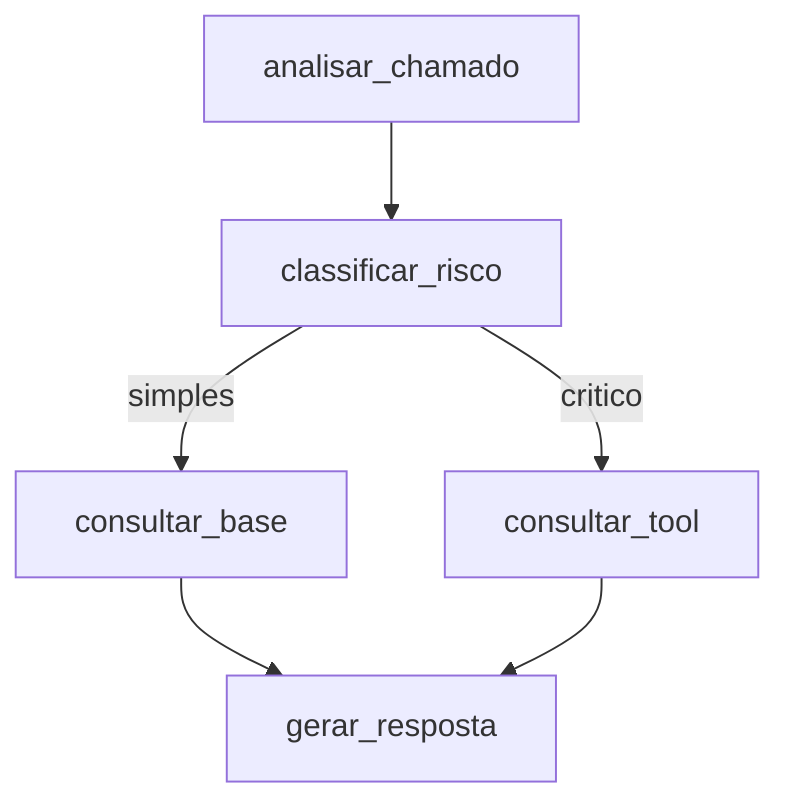

# Agente Inteligente de Triagem de Chamados Técnicos

## 1. Descrição da Solução e Objetivo
Este projeto consiste em um Agente Inteligente para Triagem de Chamados Técnicos. O objetivo é receber um chamado (com título e descrição), analisá-lo e classificar seu risco. Dependendo da severidade, o agente aciona uma base de conhecimento para problemas simples ou uma ferramenta operacional crítica para chamados severos (exigindo aprovação humana). O resultado final é uma resposta estruturada que facilita o encaminhamento.

## 2. Arquitetura e Fluxo LangGraph
A arquitetura foi implementada utilizando **LangGraph** explícito, sem depender de agentes genéricos (como o `create_agent` legado).



## 3. Descrição do State, Nodes e Decisão Condicional
- **State**: Um `TypedDict` chamado `GraphState` armazena `ticket_title`, `ticket_description`, `risk_level`, `context`, `tool_output`, `structured_response` e `error`.
- **Nodes**:
  - `analisar_chamado`: Ponto de entrada.
  - `classificar_risco`: Chama o LLM para definir a severidade ("simples" ou "critico").
  - `consultar_base` / `consultar_tool`: Nós operacionais.
  - `gerar_resposta`: Gera o output estruturado final em formato JSON/Pydantic.
- **Decisão Condicional (`route_ticket`)**: Se `risk_level` for "critico", roteia para `consultar_tool`. Se for "simples", roteia para `consultar_base`.

## 4. Descrição da Tool
A aplicação utiliza duas tools principais:
- **`consultar_base`**: Uma tool de contexto que busca soluções documentadas (simula um RAG interno).
- **`consultar_tool`**: Uma ferramenta sensível que altera estado (ex: invalida cache). Ela possui **validação** (verifica se o ID possui pelo menos 3 caracteres) e tratamento de falhas.

## 5. Memória e Contexto
O fluxo utiliza **InMemorySaver** do LangGraph (um checkpointer) para manter a rastreabilidade do estado. A tool `consultar_base` funciona como recuperação de contexto, e os dados recuperados são mantidos no State para serem utilizados pelo node final `gerar_resposta`.

## 6. Instruções de Instalação, Execução e Testes
```bash
# Instalação
python -m venv .venv
source .venv/bin/activate
pip install -r requirements.txt
cp .env.example .env

# Execução (Demonstrará os cenários)
python -m src.main

# Testes
pytest tests/
```

## 7. Cenários Demonstrados
1. **Fluxo Principal (Chamado Simples)**: O chamado de problema de VPN/login entra, o LLM classifica como simples, a `consultar_base` é chamada trazendo o contexto e a resposta estruturada é gerada.
2. **Cenário Crítico com Human-in-the-loop**: Um chamado de falha grave entra, é classificado como "critico". O grafo **pausa a execução** e solicita autorização pelo terminal. Ao ser aprovado, executa a `consultar_tool`.
3. **Cenário de Falha**: Testado via pytest e pelo main ao enviar um ID inválido, demonstrando a validação da tool.

## 8. Evidências de QA com IA e Refinamento de Prompt
**QA com IA**:
- *Problema*: Inicialmente, os testes cobriam apenas o caminho feliz das tools.
- *Sugestão da IA*: A IA apontou que era crucial testar também a ramificação condicional (a lógica de roteamento em si), pois é o core do LangGraph.
- *Ação Adotada*: Implementado o `test_comportamento_grafo_roteamento` em `test_triagem.py`, injetando diretamente estados mockados para o validador da edge.

**Refinamento de Prompt**:
- *Problema*: O nó `classificar_risco` estava gerando textos longos ("Acho que este chamado é crítico porque..."), quebrando a edge condicional.
- *Alteração*: Modificação do prompt para: *"Retorne apenas a palavra simples ou critico."*. Adicionada também a sanitização de código `.strip().lower()`.
- *Resultado*: Classificações 100% consistentes acionando a ramificação perfeitamente.

## 9. Extensões Técnicas
- **Extensão 1: Pipeline de CI/CD** -> Implementado arquivo em `.github/workflows/ci.yml` garantindo que `pytest` é executado automaticamente em todas as PRs.
- **Extensão 2: Human-in-the-loop** -> Implementado no `graph.py` usando `interrupt_before=["consultar_tool"]`. A execução da ferramenta operacional é barrada pelo checkpointer até que uma entrada humana (via CLI) autorize a operação crítica de invalidar cache ou reiniciar servidores.

## 10. Limitações e Vídeo
- **Limitações**: Como não estamos usando banco de dados real para ferramentas operacionais, as execuções de ferramentas são logs e mock-returns. As extrações de tickets poderiam ser mais robustas.
- **Vídeo de Demonstração**: [Link do Vídeo Não Listado no YouTube]
